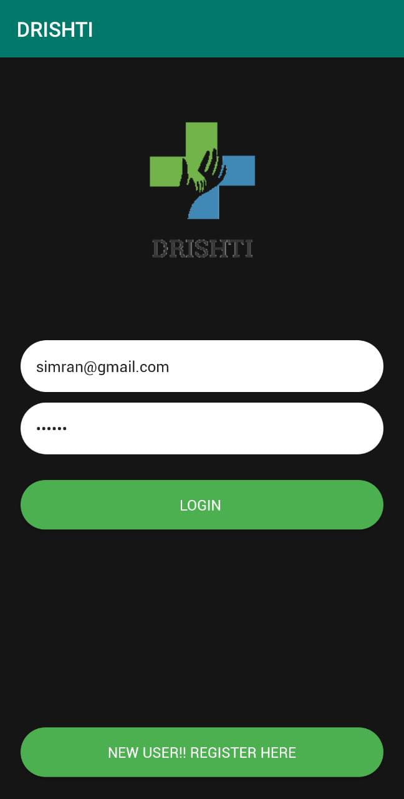
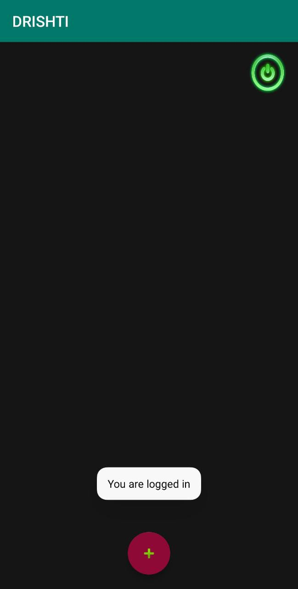
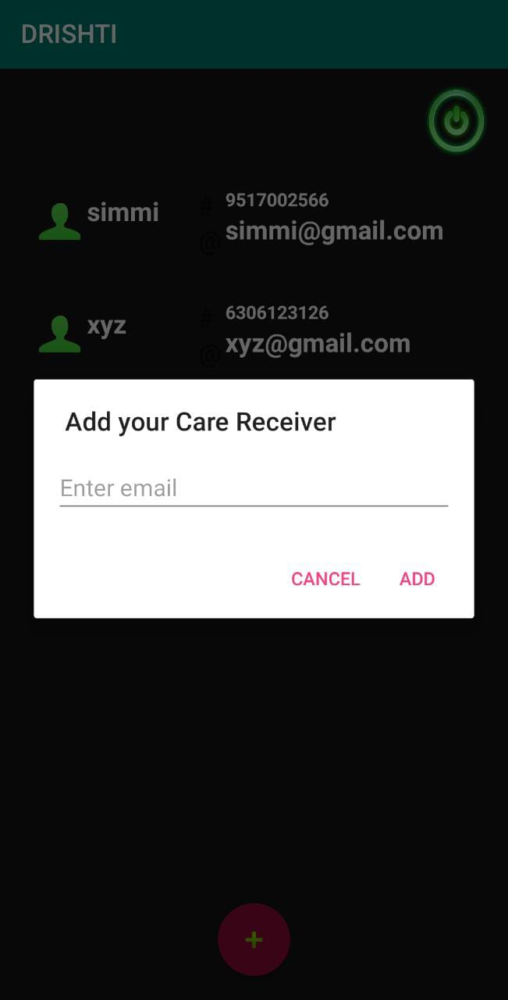
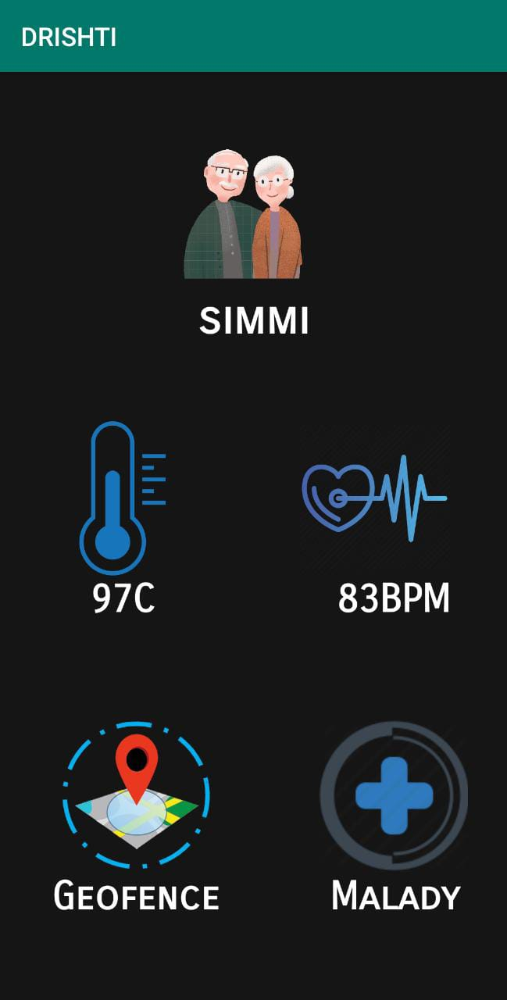
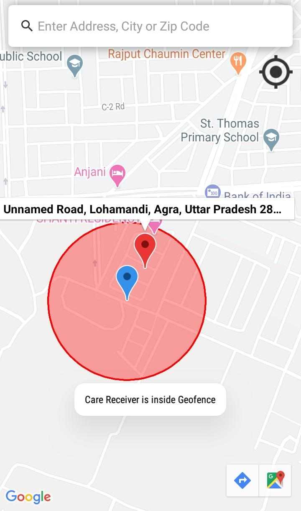
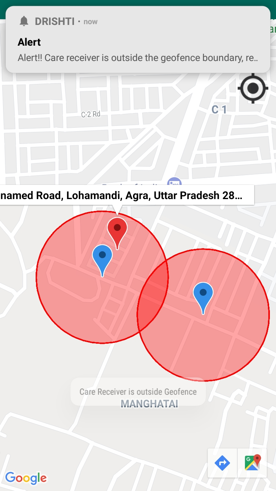
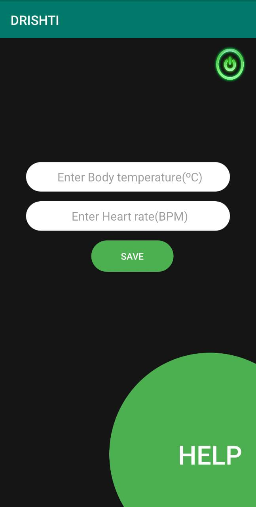
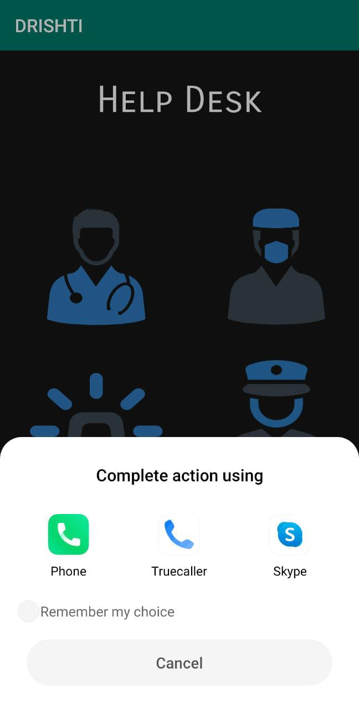

# SIH2020_GeForce
SIH2020
## Drishti Application
Drishti is basically a technology based solution for kids, senior citizens, especially specially abled individuals or any one who needs supervision. 
Drishti is a state of the model that has several innovative features which bring more values to these individuals.
## Features of the Application
It is an application that supports both care takers and care recievers.The major features are as follows:
1. **Geo-Fencing**
1. **Health Parameter Tracking**
   1. **Heartbeat Rate Tracking**
   2. **Body Temperature Treacking**

1. **Alarm in case of emergency**

Drishti first establishes a secure connection between care reciever and care taker.
The care taker designates a geofence around a loaction that care receiver resides in. 
If the care receiver ever exists the designated area, care takers are immediately notified through the app.For health monitoring the normal values of a person's heartbeat rate and temperature are recorded on the application itself.
It is further interfaced with sensors that keep on collecting these health parameters. This raw data collected by sensors is compared to the recorded values on app, in case of major deviations the care taker is notified.

A help button is present on the care receiver side that alarms the care taker in case of emergency, when pressed.

## Description of Application

### Care Taker Screen
#### 1. Login Screen

#### 2. Add Care receivers

#### 3. List of care receivers

#### 4. Get Location of Care receivers

#### 5. Map displaying location of care receivers

#### 6. Emergency notification from care receivers

### Care Receiver Screen
#### 1. Login Screen

#### 2. Define Health Parameters and Help Button

## Authors
1. Vishal Kumar 
1. Nitesh Chaurasiya
1. Anika Sharma
1. Simran Singh
1. Rajat Baghel
1. Anurag Agarwal 

## Technical Stack
Android Studio (Open Source platform for app development),Amazon Web Services, Google Map API,XML,Java

